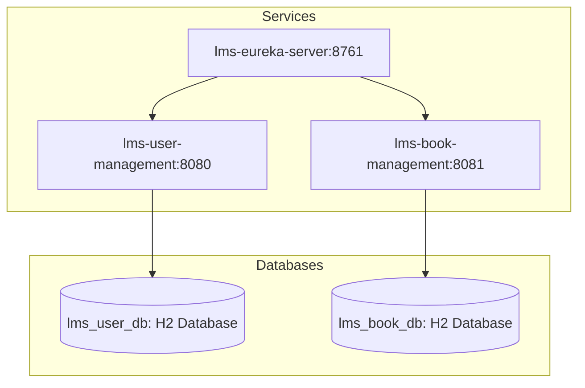

# Library Management System

This project is designed to manage a library system with two main services: user management and book management. The system is built using Spring Boot and leverages Eureka for service discovery.
 
## Prerequisite 
- Java 17 or Higher Version
- Maven

## High-Level Architecture Diagram

## Non Functional Requirements

| Component               |Comment                |                  
|----------------|-------------------------------|
|Cache|Use Cache Abstraction API to enable the cache in the spring boot application.           |           
|Database          |Use a relational database since Book & User data can manage structured data that are related and need to be secure, consistent, and rules-based.          |           
|Unit Test          |Integration & Unit tests are available in the application. Use Junit & Mokito frameworks.
|Logs|Use slf4j for logs action.|
|Exception|Use `GlobalExceptionHandler` and customize exceptions to handle specific exceptions. All the exceptions are logged with HTTP status code, message & timestamp|
|Validation|Validate the domain object using `spring-boot-starter-validation`|
|Documentation|Use Swagger to open API documentation. Documentations are aviable in below mentioned links; - http://localhost:8080/swagger-ui/index.html#/, http://localhost:8081/swagger-ui/index.html#/
|Resiliency|Use circuit breaker patten to maintain the resiliency of the application|
